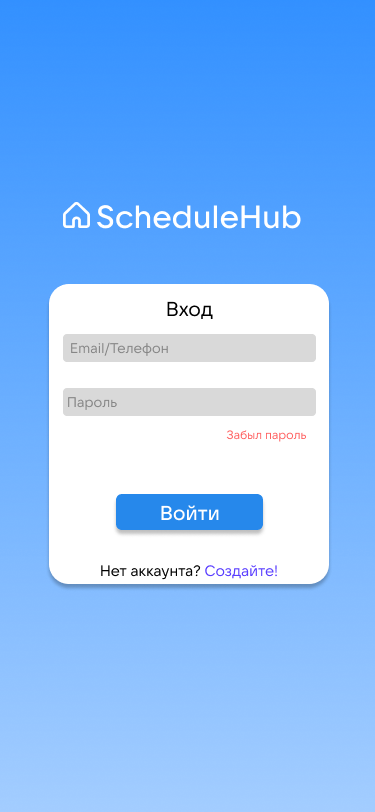

# Введение или краткое описание

Целью проекта является: Разработать аналог электронного дневника для СПО и ВУЗов, не требующий внедрения в систему образования на государственном уровне

# Необходимые условия для использования продукта

Для использования проекта необходимо стабильное подключение к интернету.

# Порядок использования

Для модификации проекта необходимо использовать Visual Studio Code. Необходимо иметь навыки в использовании HTML, CSS, JS, PHP, SQL.

Для запуска приложения необходимо перейти по ссылке: SheduleHub.com

# Cкриншоты

