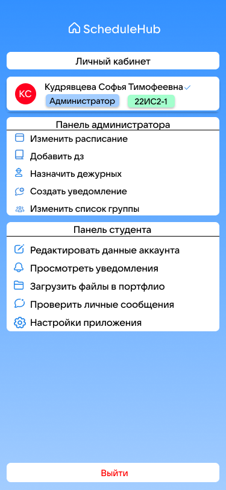
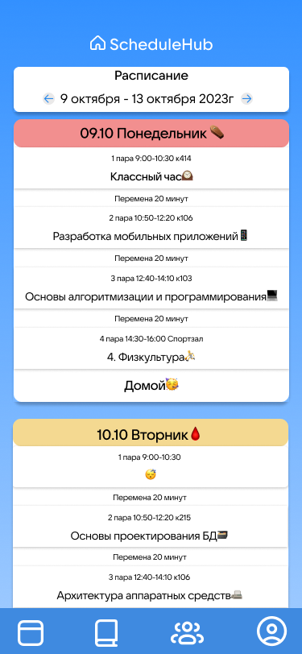

# ScheduleHub

Wелью проекта является: Разработать аналог электронного дневника для СПО и ВУЗов, не требующий внедрения в систему образования на государственном уровне

Для использования проекта необходимо стабильное подключение к интернету.

Для модификации проекта необходимо использовать Visual Studio Code. Необходимо иметь навыки в использовании HTML, CSS, JS, PHP, SQL.

Для запуска приложения необходимо перейти по ссылке: SheduleHub.com

.png> "Начальный экран 1")

